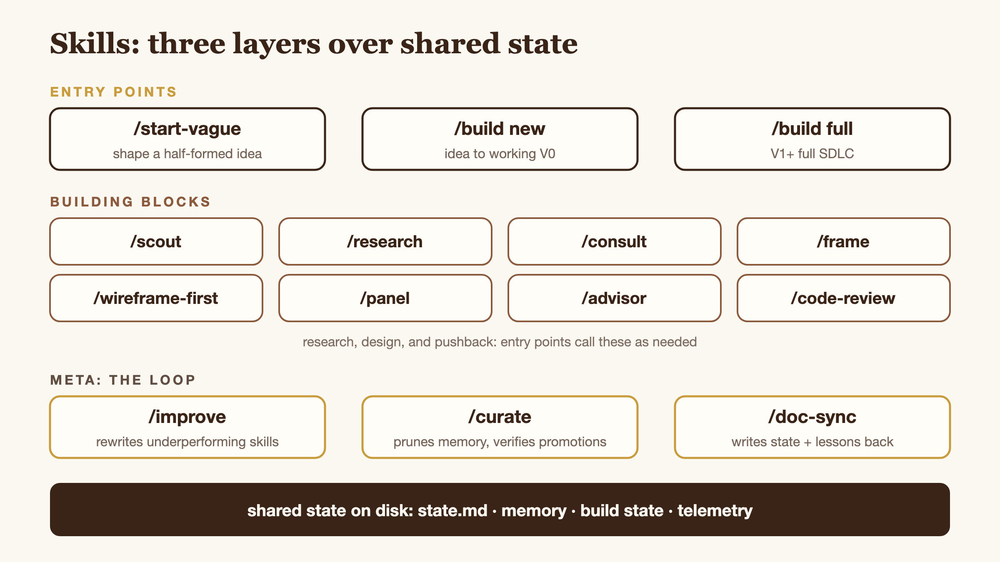

# Skills

Each skill is a folder with a `SKILL.md` (instructions) and optional supporting files. Skills load their full body only when invoked via `/<command>`. The system prompt sees only the name and description.

## How they fit together

<p align="center">
  
</p>

Three layers: **entry points** (what the user invokes), **building blocks** (called by `/build`, also runnable standalone), and **meta** (operate on the harness, not on a project). Everything reads and writes through a shared state substrate so context survives session boundaries.

## Index

| Skill | Command | Purpose |
|-------|---------|---------|
| Scout | `/scout <question>` | Quick answers: Reddit + YouTube + web, 2-3 min. **Default for most questions.** |
| Consult | `/consult <decision>` | Decision accelerator: domain expert tradeoffs + recommendation. Free (no API calls). |
| Code Review | `/code-review <path-or-git-range>` | Clean-context Claude subagent runs adversarial review. Critical/High/Medium/Low findings. Standalone or `--against <spec>`. |
| Wireframe First | `/wireframe-first <screen>` | Iterative wireframing method for ONE screen: ASCII boxes, beat-by-beat, ratify before code. Prevents rebuild-loops when intent is ambiguous. |
| Research | `/research <topic> [--quick]` | Multi-model research with paper artifact. `--quick` skips scoping + adversarial review. Use when `/scout` isn't enough. |
| Frame | `/frame [--quick \| --deep]` | Design system (DESIGN.md), architecture diagrams, wireframes. Called by `/build` or standalone. |
| Build | `/build new <idea>` | V0 pipeline: ship a working app, resumable across sessions. |
| Build Full | `/build full <project>` | Full SDLC: PRD → tech spec → arch review → build → QA → ship. |
| Improve | `/improve <skill>` | Autonomous skill improvement loop with rubric scoring. |
| Curate | `/curate` | Weekly memory consolidation. |
| Doc-Sync | `/doc-sync` | Session documentation: state, logs, alignment. **Run every session.** |
| Start Vague | `/start-vague [optional: idea]` | Front door for vague ideas. Bounded 4-round interview shapes an itch into a buildable `idea.md`. Mid-fire scout + ASCII wireframe + soft-redirect when the idea already exists. |
| Advisor | `/advisor [decision]` | Detached agent (defined in `.claude/agents/advisor.md`): checks a decision against project artifacts, reports mismatches. Auto-fires on scope/depth mismatch in `/build full` Stage 0. |
| Gap Handler | `/gap-handler` | Return-after-gap restart protocol — pre-written by gap length (short/medium/long) so resuming doesn't require deliberation. |
| Panel (retired) | `/panel` | RETIRED v1.21 — absorbed by `/build new` Stage 0's interview gate (`vera-system/memory/interview-method.md`). Tombstone only; deletes next release. |

### Internal-only skills

These have no slash command. Other skills read their `SKILL.md` inline as context.

| Skill | Read by | Purpose |
|-------|---------|---------|
| TDD | `/build full` Phase 5 (`phases.md`) | Red-green-refactor cycle for each test in the phase plan. Governs HOW each test gets written. |

## Cost awareness

| Skill | Typical Cost |
|-------|-------------|
| `/research` | $0.15–0.55 (standard to deep; Reddit leg routes through Sonar at ~$0.005/query) |
| `/improve` | ~$0.20–0.40 per cycle |
| `/build` (scoring) | ~$0.12 per score |
| `/scout` | $0.00–0.10 (Reddit via Sonar ~$0.005/call; depends on YouTube usage) |
| `/consult`, `/curate`, `/doc-sync`, `/build full` (excluding research/scoring) | Free |
| `/build new` Stage 0 interview gate | Free |

`/consult` and the Stage 0 interview gate are free because they run inside the Claude Code session (Explore subagents / direct conversation), not paid OpenRouter calls.

**Rule:** Don't call Claude via OpenRouter. You ARE Claude.

## Adding your own skills

Create `.claude/skills/<name>/SKILL.md`:

```markdown
---
name: my-skill
description: "What this skill does and when to invoke it."
allowed-tools: Bash(python3 vera-system/scripts/*) Bash(git *)
---

# My Skill

Instructions for when this skill is invoked via `/my-skill`.
```

Restart Claude Code (or run `/skills`) so the new skill registers.

## Bridge skills (external tool integrations)

Want to mirror Vera state to Obsidian, sync ROADMAP.md with Notion, or post to Slack? Build a regular skill that does it. No special infrastructure needed: a skill is a skill.

**Pattern:** Create `.claude/skills/<tool>-bridge/SKILL.md` with instructions for what to read, where to write, and when to run. Add it to `/doc-sync` or `/curate` as a post-completion step if you want it to fire automatically.

**Example (Obsidian state mirror):**
```
.claude/skills/obsidian-mirror/SKILL.md:
  Read vera-system/state.md, copy to $OBSIDIAN_VAULT_PATH/Vera/state.md.
  Run after /doc-sync completes.
```

**Security note:** Bridge skills run with full local permissions (same as any Claude Code skill). Only use skills you wrote or have personally reviewed. There is no sandbox.
