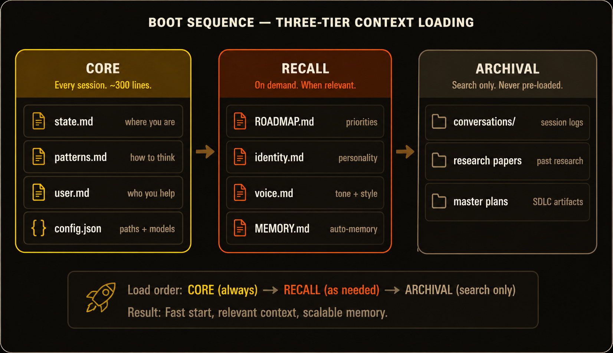

# 🐘 OpenVera

<p align="center">
  <strong>Claude forgets. OpenVera won't.</strong>
</p>

<p align="center">
  <a href="LICENSE"></a>
  
  
</p>

<p align="center">
  <a href="https://openvera.ai"><strong>openvera.ai</strong></a>
</p>

---

OpenVera is a workspace you open in [Claude Code](https://docs.anthropic.com/en/docs/claude-code). It gives Claude persistent memory, reusable skills, and behavioral patterns so that session 50 is actually better than session 1.

Most Claude Code setups are stateless. Every conversation starts cold. OpenVera changes that:

- **Running state file** that picks up where the last session ended
- **Pattern library** that grows from real mistakes, so the same gotcha doesn't bite twice
- **Skills that improve their own instructions** over time
- **Standardized output** so every build produces the same set of files (idea, spec, working code, screenshot) and you always know where to look
- **`/start-here`** to validate the idea works before committing to a full build
- **Repeatable patterns** that compound as you learn

The model is the same. A customized harness wins.

Try `/start-here` if you have a vague idea, or `/build new <idea>` if you know what you want.

## Get Started

**One-liner.** Clones into `./openvera`, then runs the interactive bootstrap:

```bash
curl -fsSL https://raw.githubusercontent.com/Reef123/OpenVera/main/install.sh | bash
```

Pass a custom path:

```bash
curl -fsSL https://raw.githubusercontent.com/Reef123/OpenVera/main/install.sh | bash -s -- ~/projects/my-harness
```

**Or manual** (if you'd rather inspect the [`install.sh`](install.sh) first, which is recommended):

```bash
git clone https://github.com/Reef123/OpenVera.git openvera
cd openvera
./bootstrap.sh
```

Either way, the bootstrap asks your name and optional API keys, fills in the templates, runs a health check, and prints next steps. After that, Claude boots into OpenVera automatically whenever you open this folder with `claude`.

## Why It's Built This Way

A few choices shape everything else:

- **Files over chat.** State, memory, and patterns live as files on disk. Not in the conversation. If it's not in a file, it doesn't exist after a reboot, and that's the whole point.
- **Three-tier context.** Core (~300 lines) loads every session. Recall loads on demand. Archival is search-only. The context window doesn't fill up with stuff that isn't relevant right now.
- **Skills load lazy.** A skill is just a name and a one-line description in the system prompt. The full instructions only load when you invoke `/<command>`. You can have 50 skills without paying token cost for the 49 you didn't use.
- **State on disk, not in the model.** Every skill reads and writes to the same files (`state.md`, `ROADMAP.md`, `MEMORY.md`, `patterns.md`). Session 50 sees what session 1 wrote. That's how it compounds.

## What's In Here

### Boot Sequence

When Claude opens this workspace, `CLAUDE.md` loads context in three tiers:

<p align="center">
  
</p>

Core loads every session (~300 lines). Recall loads when relevant. Archival stays on disk until you search for it. This keeps the context window from filling up with stuff Claude doesn't need right now.

### Memory

```
memory/
  MEMORY.md      <- things Claude has learned (appended at session end by /doc-sync, pruned weekly by /curate)
  patterns.md    <- decision frameworks (you curate these)
```

`MEMORY.md` grows automatically. Claude writes down operational gotchas, your preferences, project decisions. `patterns.md` is where you put the real wisdom: "when I get excited about a feature, check for scope creep" or "external advice means verify first, implement second." These fire as guardrails during actual work.

### Conversation History

Every session writes a snapshot to `vera-system/conversations/NNN-YYYY-MM-DD.md`:

- Triggered by `/doc-sync` (run it manually, or get auto-nudged before context compression)
- Captures session summary, course corrections, files changed, state at end
- Logs are gitignored, so they stay local to your machine and never get pushed
- Fresh installs start at session 1; history grows session-by-session

### Skills

Slash commands that do real things, in two kinds:

- **Skills** live in `.claude/skills/<name>/SKILL.md`. Their full instructions only load when you invoke them; until then they're just a name and one-liner in the system prompt.
- **Commands** live in `.claude/commands/<name>.md`. Short, focused prompt templates that orchestrate skills.

Three layers: entry points, building blocks, and meta.

<p align="center">
  
</p>

Costs below are typical USD ranges per invocation. Paid skills route through OpenRouter for model calls; free skills use Claude directly (your existing Claude Code subscription).

| Command | What It Does | Cost (USD) |
|---------|--------------|------|
| `/start-here` | Takes a vague idea and turns it into something buildable | Free |
| `/scout <question>` | Quick research: Reddit, YouTube, web. 2-3 minutes. | $0.08–0.18 |
| `/research <topic>` | Deep multi-model research. 8 steps, source registry, paper output. | $0.23–0.63 |
| `/consult <decision>` | Simulates a panel of domain experts, gives you one recommendation | Free |
| `/frame` | Generates a design system, architecture diagrams, wireframes | Free |
| `/panel [path]` | Pressure-test the bet before `/build`. 2 domain reviewers (read-only, clean-context) scan for blind spots: what's stated, missing, assumed. Confirmation-bias prevention. | $0.13–0.23 |
| `/advisor [decision]` | Checks a decision against project artifacts, reports mismatches. Auto-fires on scope/depth mismatch in `/build full` Stage 0. | Free |
| `/build new <idea>` | V0: idea to working app in one session | ~$0.12 (scoring) |
| `/build full <project>` | Full SDLC: PRD, tech spec, arch review, phased builds, QA | Varies (research + scoring) |
| `/improve <skill>` | Runs a skill, scores the output, proposes instruction fixes | $0.28–0.48 / cycle |
| `/curate` | Weekly memory cleanup: prunes stale stuff, merges duplicates | Free |
| `/doc-sync` | Updates state file, conversation log, roadmap | Free |

`/advisor` is a command. Everything else above is a skill.

### Hooks

These run mechanically, not by asking Claude to remember. Three files in `.claude/hooks/`:

- **`session-start.py`** validates config, checks `/curate` freshness, prints "OpenVera online"
- **`post-compact.py`** re-injects state and patterns after context compression
- **`session-end-reminder.py`** nudges you to run `/doc-sync` before you quit

The pre-compact gate (blocking compression until docs are saved) is configured under `PreCompact` in `.claude/settings.json` as an inline prompt hook, not a separate script file. It calls into `/doc-sync` if work has happened and the skill hasn't run this session.

## Two Ways to Build

<p align="center">
  
</p>

### V0: Just Build It (`/build new`)

You have an idea. Maybe it's half-formed. `/build new` runs the whole pipeline in one session: quick research, scope guard (cuts you to 1-2 problems), design tokens, then a build loop until it works in the browser.

You answer 2-4 short scoping questions before it goes autonomous: what's the job, what pain does this solve, what's the one action that has to work, and (if any of those leave gaps) a quick pressure-test on what Vera is about to assume. After that, it runs without interruption.

A finished V0 that solves one problem is worth more than a spec for V3 that never gets built.

### V1+: Full SDLC (`/build full`)

Your V0 works and you want to make it real. `/build full` runs the whole thing: deep research, gap analysis, PRD, tech spec, architecture review, phased builds with tests, code review, QA. This takes multiple sessions. Context is handed off through files, not memory.

Don't start here. Start with V0. If it's worth investing in, you'll know.

## Structure

```
openvera/                          <- you open this in Claude Code
├── CLAUDE.md                      <- points Claude to vera-system/
├── bootstrap.sh                   <- first-time setup
│
├── .claude/                       <- Claude Code reads this at project root
│   ├── settings.json              <- permissions + hooks
│   ├── rules/                     <- safety guardrails
│   ├── hooks/                     <- automation scripts
│   ├── agents/                    <- subagent definitions
│   ├── commands/                  <- slash commands
│   └── skills/                    <- skill definitions
│
├── vera-system/                   <- the harness content
│   ├── CLAUDE.md                  <- boot sequence + rules
│   ├── state.md                   <- where things are right now
│   ├── ROADMAP.md                 <- what's next
│   ├── ideas.md                   <- idea capture
│   ├── config.json                <- paths + model defaults
│   ├── who-i-am/                  <- identity + voice
│   ├── relationships/             <- context about you
│   ├── memory/                    <- patterns + auto-memory
│   ├── scripts/                   <- helper scripts (OpenRouter, Reddit, YouTube, etc.)
│   └── conversations/             <- session logs
│
└── vera-projects/                 <- output goes here
    ├── projects/                  <- one folder per project
    └── research-output/           <- standalone research papers
```

## Make It Yours

After bootstrap, edit these:

- **`who-i-am/voice.md`** sets the tone (direct, casual, formal, whatever you want)
- **`relationships/user.md`** is who you are, so Claude can tailor responses
- **`memory/patterns.md`** starts empty; add patterns as you discover them

To add a skill, create `.claude/skills/<name>/SKILL.md` with YAML frontmatter (name + description) and instructions in the body.

To change paths or the default LLM model, edit `vera-system/config.json`.

### Keys are Optional

**After install, OpenVera makes no background network calls.** No telemetry. No phone-home. Hooks and the harness itself are local-only. Audit them yourself in `.claude/hooks/` and `vera-system/scripts/`.

The only scripts that touch the network are the three you'd expect: `openrouter.py` (multi-model research), `reddit-fetch.py` (community recon), `youtube-analyze.py` (video analysis). All run only when a skill you invoked calls them.

Install-time exceptions: `git clone` pulls the repo, `pip install` fetches Python deps, and if you paste an OpenRouter key into bootstrap, it does a one-shot `GET /auth/key` to verify it. Skip the prompt to skip the call.

**Works without keys:**
`/start-here`, `/consult`, `/frame`, `/advisor`, `/curate`, `/doc-sync`. `/scout` works for Reddit + web (YouTube discovery is the only part that needs a key).

**What degrades without keys:**
- `/build` still ships, but the external scoring step is skipped (the rival-model quality gate). You still get validator + reviewer agents.
- `/improve` needs OpenRouter for its scoring loop.
- `/research` needs OpenRouter (multi-model is the whole point).

Try OpenVera for a session. Decide if you trust it. Add keys later if you want the scoring gate or deep research.

When you do:
```bash
cp vera-system/.secrets.template vera-system/.secrets
# edit vera-system/.secrets
```

The `.secrets` file is gitignored and chmod 600. Permissions require Claude to ask before reading it.

## Recommended MCPs

OpenVera's skills work without these, but they make a real difference:

| MCP | What It Adds | Install |
|-----|-------------|---------|
| **Playwright** | `/build` verifies your app in a real browser instead of jsdom. Catches bugs that pass unit tests. | `claude mcp add playwright -- npx @playwright/mcp@latest` |
| **Context7** | Up-to-date library docs injected into `/research` and `/build`. Prevents Claude from using stale training data for fast-moving libraries. | `claude mcp add context7 -- npx -y @upstash/context7-mcp` |

Run each once. They stick across projects.

## Requirements

- [Claude Code](https://docs.anthropic.com/en/docs/claude-code) CLI
- Python 3.8+
- Windows: run bootstrap via Git Bash or WSL (not cmd.exe or PowerShell directly)
- Optional: [OpenRouter](https://openrouter.ai) key (multi-model research)
- Optional: [Google AI](https://aistudio.google.com/apikey) key (YouTube analysis in /scout)

## When Things Break

See [RECOVERY.md](RECOVERY.md), a short guide for hook errors, missing skills, broken bootstrap, doctor warnings.

## License

MIT. See [LICENSE](LICENSE).

Built by [Shareef Ellis](https://x.com/shareefatwork). Inspirations in [THANKS.md](THANKS.md).
