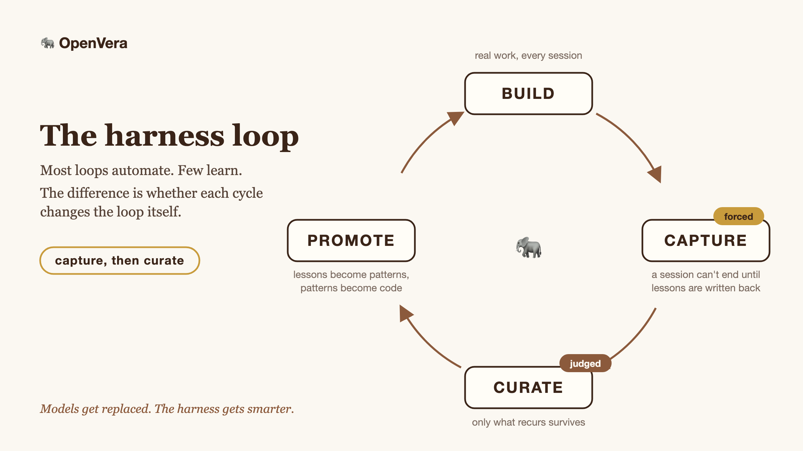
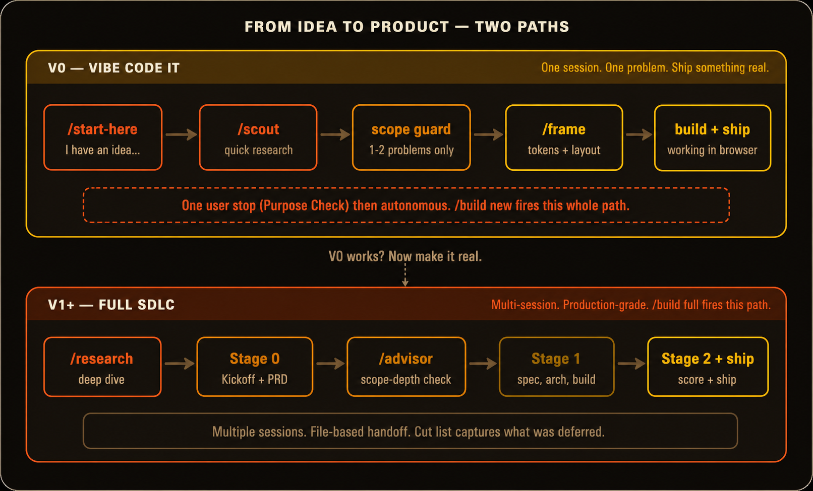

<h1 align="center">🐘 OpenVera</h1>

<p align="center">
  <strong>A personal AI workbench built on <a href="https://docs.anthropic.com/en/docs/claude-code">Claude Code</a>.</strong><br>
  It researches before building, ships a working prototype, reviews its own code, and remembers all of it for next time.
</p>

<p align="center">
  <em>Models get replaced. The harness gets smarter.</em>
</p>

<p align="center">
  <a href="LICENSE"></a>
  
  
  
</p>

<p align="center">
  <a href="#get-started">Get Started</a> ·
  <a href="#your-first-ten-minutes">First Ten Minutes</a> ·
  <a href="#the-loop">The Loop</a> ·
  <a href="#skills">Skills</a> ·
  <a href="#what-openvera-wont-do">What It Won't Do</a> ·
  <a href="https://openvera.ai">openvera.ai</a>
</p>

---

## The Problem

You know the routine. Monday, you and your AI ship something good. Tuesday, it can read every file you two wrote and still has no idea where you left off. The approach you tried and killed, the decision that took an hour to settle, the bug that ate your evening: gone with the chat. So you re-explain, and some of what you explain is wrong, because you don't remember Monday perfectly either.

And here's the part that should bother you more: everyone is running the same model. You, me, the person who installed it an hour ago. A year of projects together buys you no edge over somebody who started this morning, because nothing the two of you learned survived a single session.

OpenVera is the part you own. It wraps Claude Code in files, skills, hooks, and scripts: a process the model can't skip. It researches before it builds and pushes back on scope before you burn an evening on the wrong thing. Work gets verified in a real browser before anything gets called done. And everything worth keeping gets written down: state, decisions, lessons, your taste in how things get built. Plain files you can read, grep, edit, and carry anywhere. You rent the model. The files are yours. Session fifty starts where session one left off, and by then the harness knows how you build.

Every session opens with a cockpit: what moved, the next action per open thread, and what's blocked on you. Whatever you paste in mid-thought lands in `inbox.md` and gets routed next session instead of dying in scrollback.

The whole idea in one breath:

> I have an idea. I open it and start building. It writes down what we did so I don't lose it. And the framework comes with me to the next one.

## One Install, the Whole Arc

| Stage | What you get | Where |
|-------|--------------|-------|
| Shape | A vague idea becomes a buildable one | `/start-vague` |
| Research | Multi-model research with a source registry, plus 2-3 minute community recon | `/research`, `/scout` |
| Pushback | Interview gate, scope guard, one-way-door check, simulated expert panel | `/build new`, `/consult` |
| Design | Design tokens, wireframes signed off before code, architecture diagrams | `/frame`, `/wireframe-first` |
| Build | Idea to working prototype in one session, or full SDLC across many | `/build new`, `/build full` |
| Verify | Real-browser checks, a done-ledger the model can't quietly edit, external scoring | `/build`, Playwright MCP |
| Review | Clean-context code review, decisions checked against project artifacts | `/code-review`, `/advisor` |
| Remember | State, lessons, cockpit, and inbox survive the session | `/doc-sync`, hooks |
| Improve | Skills that score their own output and fix their own instructions | `/improve`, `/curate` |
| Recover | A restart protocol sized to how many days you've been gone | `/gap-handler` |

Each stage stands alone. The rest of this README walks the ones that need more than a row.

## Get Started

```bash
curl -fsSL https://raw.githubusercontent.com/Reef123/OpenVera/main/install.sh | bash
```

Clones into `./openvera` and runs the interactive bootstrap. Append `-s -- ~/some/path` to choose where it lands.

> [!NOTE]
> Piping curl into bash is a trust decision. The script is short. Read [install.sh](install.sh) first, or clone and run bootstrap by hand:

```bash
git clone https://github.com/Reef123/OpenVera.git openvera
cd openvera
./bootstrap.sh
```

Bootstrap asks your name and optional API keys, fills the templates, and runs a health check. At the end it offers to open Claude Code, so just press Enter. From then on, Claude boots into OpenVera automatically whenever you open the `openvera/` folder.

API keys are optional. The harness, most skills, and the whole memory loop run on your existing Claude Code subscription. Keys add deep research, `/scout` depth, and an external scoring gate ([details](#keys-are-optional)).

## Your First Ten Minutes

The shape of a first session. Illustrative: your questions, timings, and project will differ.

```text
$ claude

  🐘 OpenVera online. First session, curate triggers in 7 days.
  First build: /start-vague (vague idea) or /build new <idea> (clear one)

> /build new a price-per-serving calculator for my recipes

  A few scoping questions, one at a time:
    Who is this for, just you or others too?       → just me
    What's the ONE action that has to work?        → paste ingredients, see cost per serving
  (and a quick pressure-test if your answers leave a risky assumption)

  Then it runs on its own: scope guard (trims to one problem) →
  design tokens → build loop (pass 1 failed the paste handler;
  pass 2 fixed it) → browser first-paint check

  🐘 Shipped: vera-projects/projects/recipe-cost/
     Run it:   cd vera-projects/projects/recipe-cost && npm run dev
     Verified: paste → cost renders in browser
     V1 candidates ranked in handoff.md

> /doc-sync

  state.md updated, session logged to conversations/001-….md
  lesson captured: - 2026-06-10 [build/recipe-cost] textarea paste
    events need explicit handling in Svelte 5
  Safe to close.
```

That last step is enforced. End a session with unsynced work and a hook blocks it once and points you at `/doc-sync`. The harness polices its own loop. That is the whole idea, and the next section is how.

## The Loop

<p align="center">
  
</p>

Most agent loops automate. Few learn. The difference is whether each cycle changes the loop itself. OpenVera's loop has four organs, and each one is mechanical:

**Capture is forced.** Failures and course corrections append one dated line to `memory/lessons.md`. The `textarea paste` line in the first-ten-minutes transcript is what capture looks like in practice. A Stop hook blocks the session from ending while state is unsynced. Zero lessons is a valid session: the gate forces the write-back, never the wisdom. You can't theater a file write.

**Curation is judged.** `/curate` runs weekly. One-off lessons age out. Anything that recurs three or more times gets flagged for promotion into `patterns.md`. You approve every promotion. The machine never edits your patterns file.

**Promotion is verified.** Every promotion lands in `memory/promotions.tsv` with a fate. Gone for 14 days: validated. Recurs anyway: marked failed and flagged for mechanical enforcement, a hook or a doctor check instead of prose. Words that don't work graduate into code that does.

**The loop is measured.** `loop-report.py` answers one question: what does cycle fifty know that cycle one didn't?

```text
**Loop report 2026-06-10.** Since cycle 1 the loop has captured 31 lessons
(9 in the last 30 days), promoted 4 into patterns (3 validated, 1 failed),
and run 22 skill invocations in the last 30 days (86% pass).
```

When a skill underperforms, `/improve` runs it against tests, scores the output, proposes one change to the skill's own instructions, and re-runs everything to check for regressions before you accept.

## Before Code: Research and Pushback

The same skepticism runs upstream, before any code exists.

**Research.** `/scout` is a 2-3 minute recon: Reddit and YouTube for what real people hit. `/research` goes deep, across multiple models so one model's blind spots get caught, with a source registry so claims are checkable. External findings stay untrusted: extract the technique, verify packages and env vars before you adopt.

**Pushback.** `/build new` opens with a soft interview gate before any code: one question at a time, biggest decisions first, each carrying a recommendation. One question arrives with no recommendation attached, because it checks whether you're pointed the right way, and that answer has to come from you. Skip the whole gate with one word if you don't need it. A scope guard then cuts the prototype to one or two problems, because a finished prototype that solves one problem beats a spec for V3 that never ships. And before any build starts, a quick check asks whether the next decision is easy to undo. One-way doors get a nudge to think first.

## Skills

Slash commands that do real things. Each sits in the system prompt as one line until you invoke it; the full instructions load only then. Keep dozens on hand, pay the token cost only for the one you run. Most are free on your existing Claude Code subscription; paid skills spend on OpenRouter calls.

| Command | What It Does | Cost (USD) |
|---------|--------------|------|
| `/start-vague` | Takes a vague idea and turns it into something buildable | Free |
| `/scout <question>` | Quick research: Reddit, YouTube, web. 2-3 minutes. | $0.00-0.10 |
| `/research <topic>` | Deep multi-model research. 8 steps, source registry, paper output. | $0.15-0.55 |
| `/consult <decision>` | Simulates a panel of domain experts, gives you one recommendation | Free |
| `/frame` | Generates a design system, architecture diagrams, wireframes | Free |
| `/wireframe-first` | Sketches one screen in plain text and gets your sign-off before any code | Free |
| `/advisor [decision]` | Checks a decision against project artifacts, reports mismatches | Free |
| `/code-review [path]` | Clean-context reviewer scans a path or diff, returns tiered findings | Free |
| `/build new <idea>` | First version: idea to working prototype, resumable across sessions | Free (~$0.12 scored) |
| `/build full <project>` | Full SDLC: PRD, tech spec, arch review, phased builds, QA | Varies |
| `/improve <skill>` | Runs a skill, scores the output, proposes instruction fixes, verifies no regressions | ~$0.20-0.40 / cycle |
| `/gap-handler` | Restart protocol after days away, sized to the length of the gap | Free |
| `/curate` | Weekly memory consolidation: prunes, merges, verifies promotions | Free |
| `/doc-sync` | Updates state file, conversation log, roadmap, lesson capture | Free |

## Two Ways to Build

<p align="center">
  
</p>

Both start from an idea. If yours is still vague, run `/start-vague` first to shape it into a buildable `idea.md`.

- **`/build new`: one session, idea to prototype.** Scoping questions, scope guard, design tokens, then a build loop until it works in the browser. The state file persists, so `/build continue` picks up exactly where you left off when context compresses or you stop for the night. A feature counts as done only once it's verified working, tracked in a ledger the model can't quietly edit. Resuming a build re-checks the app still runs before any new work starts, so a broken session boundary gets caught instead of built on.
- **`/build full`: multi-session, prototype to production.** Deep research, gap analysis, PRD, tech spec, architecture review, phased builds with tests, code review, QA. Context is handed off through files, not memory. Don't start here. Start with `/build new`; if it's worth investing in, you'll know.

## Why It's Built This Way

- **Files over a database.** State, memory, and patterns are plain markdown and TSV, not a vector store. You can read, grep, diff, and carry every memory anywhere. At personal scale, inspectability beats retrieval cleverness.
- **Three-tier context.** Core (~300 lines) loads every session, Recall loads on demand, Archival is search-only. The window doesn't fill with what isn't relevant right now.
- **Skills load lazy.** Each skill is one line in the system prompt until invoked. Keep 50 on hand, pay for the one you run.
- **Enforcement over discipline.** Anything the loop depends on is a hook or a script in `.claude/hooks/`, not a reminder. Deterministic Python, readable in one sitting. Habits decay; gates don't.
- **Cheap tier for plumbing, capable tier for judgment.** Subagents that fetch, format, or sync run on a cheaper model tier; the calls that decide scope, review code, or gate a release stay on the capable one. Parallel throughput without paying capable-model prices for work that doesn't need it.

## What OpenVera Won't Do

Enforced in `.claude/settings.json` and the hooks, not promised in prose. Audit them yourself.

- **Won't run `sudo` or `rm -rf`, or read your secrets.** `.env` files, SSH keys, and cloud credentials are denied outright; `.secrets` requires your explicit approval each time.
- **Won't force-push, hard-reset, or kill processes without asking.**
- **Won't push anywhere.** Nothing in the harness runs `git push`. Commits stay local until you push them yourself.
- **Won't edit your patterns.** `patterns.md` is hand-curated by rule; the machine lane is separate files.
- **Won't phone home.** After install, the only scripts that touch the network are `openrouter.py` and `youtube-analyze.py`, and only when a skill you invoked calls them. Run logs and session conversation logs stay local.

## Keys Are Optional

The whole memory loop and most skills (`/start-vague`, `/consult`, `/frame`, `/wireframe-first`, `/advisor`, `/code-review`, `/gap-handler`, `/curate`, `/doc-sync`) run with no key. `/scout` covers web search keyless. `/build` ships fine, just unscored: you still get the validator and reviewer agents, only the external judge is skipped. The interview gate is free either way.

Keys add the depth. `/research` and `/improve` need OpenRouter for their multi-model calls, `/scout`'s Reddit and YouTube depth runs through OpenRouter (video analysis needs a Google AI key), and `/build`'s external scoring gate needs OpenRouter. Paste a key into bootstrap and it gets verified with one call; skip the prompts to skip the calls. There is no `pip install` step. OpenVera runs on the Python standard library alone.

To add keys later:

```bash
cp vera-system/.secrets.template vera-system/.secrets
chmod 600 vera-system/.secrets
# edit vera-system/.secrets
```

The `.secrets` file is gitignored and chmod 600; permissions require Claude to ask before reading it.

## Make It Yours

After bootstrap: set the tone in `vera-system/who-i-am/voice.md`, tell Claude who you are in `vera-system/relationships/user.md`, and add your own rules to `vera-system/memory/patterns.md`. Change paths or the default model in `vera-system/config.json`. To add a skill, drop a `.claude/skills/<name>/SKILL.md` with YAML frontmatter (name + description) and instructions in the body.

Bootstrap also asks if you want a working-style profile kept in `relationships/user.md`. It learns how to work with you without keeping a dossier on you: preferences and patterns get written down, never health, family, employer, finances, or location. You can read it, edit it, or turn it off any time by flipping `user_memory` in `config.json`.

The point of all this: OpenVera ships empty of anyone else's taste. Over your first few projects it absorbs your decisions, your defaults, your look. Then it stamps them on everything that follows.

## Recommended MCPs

Optional, but two noticeably help:

| MCP | What It Adds | Install |
|-----|-------------|---------|
| **Playwright** | `/build` verifies your app in a real browser instead of jsdom. Catches bugs that pass unit tests. | `claude mcp add playwright -- npx @playwright/mcp@latest` |
| **Context7** | Up-to-date library docs injected into `/research` and `/build`. Prevents stale training data for fast-moving libraries. | `claude mcp add context7 -- npx -y @upstash/context7-mcp` |

## Requirements

- [Claude Code](https://docs.anthropic.com/en/docs/claude-code) CLI · Python 3.8+ · git
- Windows: run bootstrap via Git Bash or WSL (not cmd.exe or PowerShell directly)
- Optional: [OpenRouter](https://openrouter.ai) key (multi-model research) · [Google AI](https://aistudio.google.com/apikey) key (YouTube analysis in `/scout`)

<details>
<summary><strong>Repo structure</strong></summary>

```
openvera/                          <- you open this in Claude Code
├── CLAUDE.md                      <- points Claude to vera-system/
├── bootstrap.sh                   <- first-time setup
│
├── .claude/                       <- Claude Code reads this at project root
│   ├── settings.json              <- permissions + hooks
│   ├── rules/                     <- safety guardrails
│   ├── hooks/                     <- automation scripts
│   ├── agents/                    <- subagent definitions
│   ├── commands/                  <- slash commands
│   └── skills/                    <- skill definitions
│
├── vera-system/                   <- the harness content
│   ├── CLAUDE.md                  <- boot sequence + rules
│   ├── state.md                   <- where things are right now
│   ├── ROADMAP.md                 <- what's next
│   ├── ideas.md                   <- idea capture
│   ├── config.json                <- paths + model defaults
│   ├── who-i-am/                  <- identity + voice
│   ├── relationships/             <- context about you
│   ├── memory/                    <- patterns, lessons, promotions ledger
│   ├── scripts/                   <- helper scripts (research, telemetry, loop report, doctor)
│   ├── runs/                      <- local telemetry + loop trend (gitignored)
│   └── conversations/             <- session logs (gitignored, local only)
│
└── vera-projects/                 <- output goes here
    ├── projects/                  <- one folder per project
    └── research-output/           <- standalone research papers
```

</details>

## When Things Break

See [RECOVERY.md](RECOVERY.md) for hook errors, missing skills, broken bootstrap, and doctor warnings.

## License

MIT. See [LICENSE](LICENSE).

Built by [Shareef Ellis](https://x.com/shareefatwork). Changelog on [@openveraai](https://x.com/openveraai). Inspirations in [THANKS.md](THANKS.md).

*The elephant remembers.*
